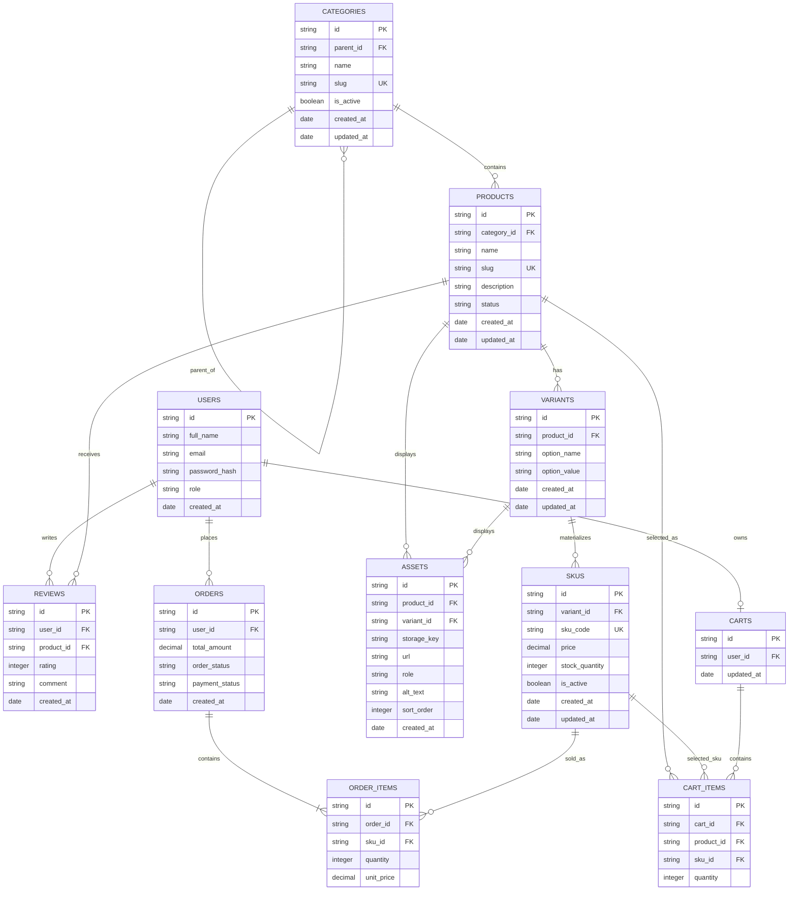

# Sprint 2 — Catalog Data Foundation

## E-Commerce Novel Store


---

# 1. Sprint Goal and Scope Boundary

## 1.1 Sprint Goal

Sprint 2 extends the architecture established in Sprint 1 into a reliable catalog data foundation for the physical novel e-commerce platform.

The primary goal is to implement the database and administration foundation required to manage:

- Categories
- Products/novels
- Product variants
- Sellable SKUs
- Product assets
- Product specifications
- Prices
- Inventory
- Administrative access

The catalog foundation will provide the data layer that later storefront, cart, and checkout functionality can consume.

The implementation will use **Node.js with Express.js** for the backend and **MongoDB** for persistent catalog data.

---

## 1.2 Sprint 2 In-Scope Features

The following functionality is included in Sprint 2:

1. Category tree management
2. Product/novel creation and editing
3. Product status management
4. Product-to-category assignment
5. Product variants
6. SKU creation and management
7. SKU price management
8. SKU stock management
9. Basic product and category administration
10. Authentication and authorization for administrator routes
11. Database validation and uniqueness constraints
12. Seed/sample catalog data
13. Automated model, validation, and authorization tests

---

## 1.3 Sprint 2 Out-of-Scope Features

The following features are intentionally excluded from Sprint 2:

- Public catalog search
- Public product browsing
- Dynamic specification UI
- Asset upload interface
- Complete publication workflow
- Payment gateway integration
- Order placement
- Shipping integration
- Complete shopper checkout
- Customer-facing storefront
- Advanced recommendation systems

These features are reserved for Sprint 3 or later.

The Sprint 2 implementation may provide data structures or API connections that future sprints can consume, but they are not considered Sprint 2 functionality.

---

# 2. Link to Sprint 1 Decisions

Sprint 2 extends the architecture and MVP decisions established during Sprint 1.

## 2.1 Project Domain

The project is an e-commerce platform for purchasing physical novels and books online.

### Target Users

- Avid fiction readers
- Non-fiction readers
- Literature enthusiasts
- Students
- Casual book buyers

### Core Problem

Traditional local bookstores may have limited stock, limited niche genres, and limited availability of new releases or specific editions.

The platform provides a structured digital catalog that allows physical books to be managed and eventually discovered and purchased online.

---

## 2.2 Sprint 1 Technology Decisions

| Layer | Sprint 1 Decision | Sprint 2 Usage |
|---|---|---|
| Frontend | HTML5, CSS3, JavaScript, Bootstrap | Future storefront/admin interface |
| Backend | Node.js + Express.js | Administrative REST API |
| Database | MongoDB | Catalog persistence |
| Authentication | JWT | Protected administrator routes |
| Payment | Stripe Test Mode | Sprint 3/later checkout integration |

Sprint 2 does **not** implement payment processing because payment gateway integration is outside the Sprint 2 boundary.

---

## 2.3 Sprint 1 MVP Integration

The original Sprint 1 entities included:

- Users
- Categories/Genres
- Products/Books
- Reviews
- Cart
- Cart Items
- Orders
- Order Items

Sprint 2 expands the catalog side of this architecture by introducing:

- Categories
- Products
- Variants
- SKUs
- Assets
- Specifications

The existing cart and order entities remain part of the overall system architecture and are connected to the new catalog model.

---

# 3. Updated ERD and Data Dictionary

## 3.1 Catalog Model

The Sprint 2 catalog model separates a **product**, **variant**, and **SKU**.

### Product

A Product represents the conceptual physical novel or book.

Example:

> The Alchemist

### Variant

A Variant represents a variation of a product.

Example:

> Paperback  
> Hardcover

### SKU

A SKU represents the actual sellable inventory item.

Example:

> ALCHEMIST-PB-001

Each SKU has its own:

- SKU code
- Price
- Stock quantity
- Active status

This separation allows the same book to have different physical editions while maintaining independent inventory and pricing.

---

## 3.2 Mermaid ER Diagram



---

## 3.3 Cardinality Rules

| Relationship | Cardinality | Description |
|---|---|---|
| Category → Child Categories | 1:N | A category may have multiple child categories |
| Category → Product | 1:N | A category can contain multiple products |
| Product → Variant | 1:N | A product may have zero or more variants |
| Variant → SKU | 1:N | A variant can contain one or more sellable SKUs |
| Product → Asset | 1:N | A product may contain multiple images/assets |
| Variant → Asset | 1:N | A variant may have variant-specific assets |
| Product → Review | 1:N | A product can receive multiple reviews |
| User → Review | 1:N | A user can write multiple reviews |
| User → Cart | 1:0..1 | A user can own one active cart |
| Cart → Cart Item | 1:N | A cart contains multiple cart items |
| SKU → Cart Item | 1:N | A SKU can appear in cart items |
| User → Order | 1:N | A user can place multiple orders |
| Order → Order Item | 1:N | An order contains one or more order items |
| SKU → Order Item | 1:N | A SKU can be referenced by multiple order items |

---

# 3.4 Data Dictionary

## Categories

| Field | Type | Rules |
|---|---|---|
| `id` | String/ObjectId | Primary identifier |
| `parent_id` | String/ObjectId | Optional reference to parent category |
| `name` | VARCHAR(255) equivalent | Required |
| `slug` | VARCHAR(255) equivalent | Required, unique |
| `is_active` | BOOLEAN | Default `true` |
| `created_at` | TIMESTAMP | Required |
| `updated_at` | TIMESTAMP | Required |

### Category Rules

- Category slug must be unique.
- `parent_id` is optional.
- A category cannot reference itself as its parent.
- A category cannot become its own ancestor.
- Deactivated categories remain in the database for historical integrity.

---

## Products

| Field | Type | Rules |
|---|---|---|
| `id` | String/ObjectId | Primary identifier |
| `category_id` | String/ObjectId | Required category reference |
| `name` | VARCHAR(255) equivalent | Required |
| `slug` | VARCHAR(255) equivalent | Required, unique |
| `description` | TEXT equivalent | Optional |
| `status` | VARCHAR(50) | `draft`, `active`, or `archived` |
| `created_at` | TIMESTAMP | Required |
| `updated_at` | TIMESTAMP | Required |

### Product Rules

- Product name is required.
- Product slug must be unique.
- Product must reference a valid category.
- A draft product may exist without a sellable SKU.
- An active/published product must have at least one active sellable SKU.

---

## Variants

| Field | Type | Rules |
|---|---|---|
| `id` | String/ObjectId | Primary identifier |
| `product_id` | String/ObjectId | Required product reference |
| `option_name` | VARCHAR(100) | Required |
| `option_value` | VARCHAR(255) | Required |
| `created_at` | TIMESTAMP | Required |
| `updated_at` | TIMESTAMP | Required |

Example:

```text
Product: The Alchemist

Variant:
option_name  = Format
option_value = Paperback
```

Another variant could be:

```text
option_name  = Format
option_value = Hardcover
```

---

## SKUs

| Field | Type | Rules |
|---|---|---|
| `id` | String/ObjectId | Primary identifier |
| `variant_id` | String/ObjectId | Required variant reference |
| `sku_code` | VARCHAR(100) | Required, unique |
| `price` | DECIMAL(10,2) | Required, must be >= 0 |
| `stock_quantity` | INTEGER | Required, must be >= 0 |
| `is_active` | BOOLEAN | Default `true` |
| `created_at` | TIMESTAMP | Required |
| `updated_at` | TIMESTAMP | Required |

Money is represented using a decimal-compatible representation rather than floating-point values.

Stock quantity cannot become negative through a normal administrative update.

---

## Assets

| Field | Type | Rules |
|---|---|---|
| `id` | String/ObjectId | Primary identifier |
| `product_id` | String/ObjectId | Product reference |
| `variant_id` | String/ObjectId | Optional variant reference |
| `storage_key` | VARCHAR(500) | Optional storage identifier |
| `url` | VARCHAR(1000) | Optional asset URL |
| `role` | VARCHAR(50) | e.g. `cover`, `gallery` |
| `alt_text` | VARCHAR(255) | Accessibility text |
| `sort_order` | INTEGER | Default `0` |
| `created_at` | TIMESTAMP | Required |

Asset upload is not implemented in Sprint 2. The data structure is prepared for future catalog asset functionality.

---

## Reviews

| Field | Type | Rules |
|---|---|---|
| `id` | String/ObjectId | Primary identifier |
| `user_id` | String/ObjectId | User reference |
| `product_id` | String/ObjectId | Product reference |
| `rating` | INTEGER | 1–5 |
| `comment` | TEXT | Optional |
| `created_at` | TIMESTAMP | Required |

Reviews remain part of the Sprint 1 architecture but are not a major Sprint 2 administration workflow.

---

## Carts

| Field | Type | Rules |
|---|---|---|
| `id` | String/ObjectId | Primary identifier |
| `user_id` | String/ObjectId | User reference |
| `updated_at` | TIMESTAMP | Required |

---

## Cart Items

| Field | Type | Rules |
|---|---|---|
| `id` | String/ObjectId | Primary identifier |
| `cart_id` | String/ObjectId | Cart reference |
| `product_id` | String/ObjectId | Product reference |
| `sku_id` | String/ObjectId | SKU reference |
| `quantity` | INTEGER | Must be greater than 0 |

---

## Orders

| Field | Type | Rules |
|---|---|---|
| `id` | String/ObjectId | Primary identifier |
| `user_id` | String/ObjectId | User reference |
| `total_amount` | DECIMAL(10,2) | Required |
| `order_status` | VARCHAR(50) | Order state |
| `payment_status` | VARCHAR(50) | Payment state |
| `created_at` | TIMESTAMP | Required |

---

## Order Items

| Field | Type | Rules |
|---|---|---|
| `id` | String/ObjectId | Primary identifier |
| `order_id` | String/ObjectId | Order reference |
| `sku_id` | String/ObjectId | SKU reference |
| `quantity` | INTEGER | Must be greater than 0 |
| `unit_price` | DECIMAL(10,2) | Price captured at purchase |

The `unit_price` is stored in the order item so historical orders are not affected when the current SKU price changes.

---

# 4. Administration Route Table

All administrative write operations require an authenticated administrator.

Base URL:

```text
/api/v1/admin
```

---

## 4.1 Product Administration

### Create Product

```http
POST /api/v1/admin/products
```

Purpose:

Creates a new draft product.

Example request:

```json
{
  "name": "The Alchemist",
  "slug": "the-alchemist",
  "description": "A philosophical novel about following dreams and discovering purpose.",
  "category_id": "category-fiction-001",
  "status": "draft"
}
```

Example response:

```json
{
  "success": true,
  "message": "Product created successfully",
  "data": {
    "id": "product-001",
    "name": "The Alchemist",
    "slug": "the-alchemist",
    "status": "draft"
  }
}
```

Possible status codes:

```text
201 Created
400 Bad Request
401 Unauthorized
403 Forbidden
409 Conflict
```

---

## 4.2 Update Product

```http
PATCH /api/v1/admin/products/:id
```

Purpose:

Updates product information or status.

Example:

```json
{
  "description": "Updated product description.",
  "status": "active"
}
```

Possible status codes:

```text
200 OK
400 Bad Request
401 Unauthorized
403 Forbidden
404 Not Found
409 Conflict
```

---

## 4.3 List Administrative Products

```http
GET /api/v1/admin/products
```

Purpose:

Returns administrative product records.

Example response:

```json
{
  "success": true,
  "data": [
    {
      "id": "product-001",
      "name": "The Alchemist",
      "slug": "the-alchemist",
      "status": "active",
      "category_id": "category-fiction-001"
    }
  ]
}
```

---

# 4.4 SKU Administration

## Create SKU

```http
POST /api/v1/admin/products/:id/skus
```

Example request:

```json
{
  "variant_id": "variant-001",
  "sku_code": "ALCHEMIST-PB-001",
  "price": 1499.00,
  "stock_quantity": 25,
  "is_active": true
}
```

Example response:

```json
{
  "success": true,
  "message": "SKU created successfully",
  "data": {
    "id": "sku-001",
    "sku_code": "ALCHEMIST-PB-001",
    "price": 1499.00,
    "stock_quantity": 25,
    "is_active": true
  }
}
```

---

## Update SKU

```http
PATCH /api/v1/admin/skus/:id
```

Purpose:

Updates:

- Price
- Stock quantity
- Active status

Example request:

```json
{
  "price": 1599.00,
  "stock_quantity": 30,
  "is_active": true
}
```

Negative stock values are rejected.

---

# 4.5 Category Administration

## Create Category

```http
POST /api/v1/admin/categories
```

Example request:

```json
{
  "name": "Fiction",
  "slug": "fiction",
  "parent_id": null,
  "is_active": true
}
```

Example response:

```json
{
  "success": true,
  "message": "Category created successfully",
  "data": {
    "id": "category-fiction-001",
    "name": "Fiction",
    "slug": "fiction",
    "is_active": true
  }
}
```

---

## List Categories

```http
GET /api/v1/admin/categories
```

Purpose:

Returns the category tree.

Example:

```json
{
  "success": true,
  "data": [
    {
      "id": "category-fiction-001",
      "name": "Fiction",
      "slug": "fiction",
      "children": [
        {
          "id": "category-mystery-001",
          "name": "Mystery",
          "slug": "mystery"
        }
      ]
    }
  ]
}
```

---

# 4.6 Error Response Format

Administrative API errors use a consistent response structure.

Example:

```json
{
  "success": false,
  "error": {
    "code": "DUPLICATE_SLUG",
    "message": "A product with this slug already exists."
  }
}
```

Duplicate SKU:

```json
{
  "success": false,
  "error": {
    "code": "DUPLICATE_SKU",
    "message": "The SKU code already exists."
  }
}
```

Invalid stock:

```json
{
  "success": false,
  "error": {
    "code": "INVALID_STOCK",
    "message": "Stock quantity cannot be negative."
  }
}
```

---

# 5. Data Integrity and Authorization Decisions

## 5.1 Unique Product Slugs

Every product must have a unique slug.

Example:

```text
the-alchemist
```

A second product cannot use the same slug.

The system returns:

```text
409 Conflict
```

when a duplicate slug is submitted.

---

## 5.2 Unique Category Slugs

Category slugs are unique.

Examples:

```text
fiction
non-fiction
self-help
biography
```

Duplicate category slugs are rejected.

---

## 5.3 Unique SKU Codes

Every sellable SKU has a unique SKU code.

Example:

```text
ALCHEMIST-PB-001
ALCHEMIST-HC-001
ATOMIC-HC-001
GATSBY-PB-001
```

A duplicate SKU code cannot be created.

---

## 5.4 Negative Stock Prevention

The system rejects:

```json
{
  "stock_quantity": -5
}
```

with a validation error.

Valid stock values are:

```text
0
1
2
3
...
```

An SKU with `0` stock remains valid but is unavailable for sale.

---

## 5.5 Price Validation

Price must be greater than or equal to zero.

Invalid:

```json
{
  "price": -500
}
```

Valid:

```json
{
  "price": 1499.00
}
```

Floating-point money calculations are avoided where possible. The database representation uses a decimal-compatible monetary value.

---

## 5.6 Category Hierarchy Validation

Categories may have parent categories.

Example:

```text
Books
├── Fiction
│   ├── Mystery
│   └── Romance
└── Non-Fiction
    ├── Biography
    └── Self-Help
```

A category cannot be its own parent.

The system also prevents a category from becoming a descendant of itself.

Example invalid operation:

```text
Fiction
  └── Mystery
        └── Fiction
```

This would create a hierarchy cycle and must be rejected.

---

## 5.7 Draft Product Without SKU

A product can exist as a draft without a SKU.

Example:

```text
Product:
The Great Gatsby

Status:
draft

SKUs:
0
```

This is permitted because administrators may prepare product information before inventory is available.

---

## 5.8 Published/Active Product Without SKU

An active/published product should have at least one active sellable SKU.

Therefore:

```text
draft + no SKU
```

is valid.

But:

```text
active + no sellable SKU
```

is rejected or prevented from being made publicly sellable.

---

## 5.9 Deactivated Category

When a category is deactivated:

- Existing products are not automatically deleted.
- Historical references remain intact.
- New products should not be assigned to an inactive category.
- Existing product records retain their category relationship until an administrator changes it.

---

## 5.10 Out-of-Stock SKU

An out-of-stock SKU is represented by:

```json
{
  "stock_quantity": 0,
  "is_active": true
}
```

The SKU remains in the database, but it is not considered currently available for purchase.

This preserves inventory identity while accurately representing availability.

---

## 5.11 Product Deactivation and Future Orders

Products and SKUs are deactivated rather than physically deleted when they may be referenced by carts or historical orders.

This prevents historical order records from losing their product/SKU references.

Order items retain their captured:

```text
SKU
Quantity
Unit Price
```

so historical order information remains stable even if the current product or SKU becomes inactive.

---

## 5.12 Administrative Authorization

Administrative write operations require:

1. Valid authentication
2. Valid JWT/session
3. User role of `admin`

Unauthenticated requests return:

```text
401 Unauthorized
```

Authenticated non-admin users return:

```text
403 Forbidden
```

---

# 6. Seed Data and Demonstration Instructions

## 6.1 Category Seed Data

The seed database contains at least two category levels.

Example:

```text
Books
├── Fiction
│   ├── Mystery
│   └── Romance
└── Non-Fiction
    ├── Self-Help
    └── Biography
```

---

## 6.2 Product Seed Data

At least three products are provided.

### Product 1

```text
Name: The Alchemist
Category: Fiction
Status: active
```

### Product 2

```text
Name: Atomic Habits
Category: Self-Help
Status: active
```

### Product 3

```text
Name: The Great Gatsby
Category: Fiction
Status: active
```

---

## 6.3 Variant Seed Data

Example variants:

### The Alchemist

```text
Paperback
Hardcover
```

### Atomic Habits

```text
Paperback
Hardcover
```

### The Great Gatsby

```text
Paperback
```

---

## 6.4 SKU Seed Data

At least four valid SKUs are provided.

| SKU | Product | Variant | Price | Stock |
|---|---|---|---:|---:|
| `ALCHEMIST-PB-001` | The Alchemist | Paperback | 1499.00 | 25 |
| `ALCHEMIST-HC-001` | The Alchemist | Hardcover | 2499.00 | 10 |
| `ATOMIC-PB-001` | Atomic Habits | Paperback | 1799.00 | 20 |
| `GATSBY-PB-001` | The Great Gatsby | Paperback | 999.00 | 15 |

---

## 6.5 Intentionally Unavailable Combination

The catalog contains an unavailable combination that is **not represented as a fake zero-stock SKU**.

For example:

```text
The Great Gatsby
Variant: Signed Collector Edition
SKU: Not created
```

Because the combination is unavailable, no fake SKU is created merely to represent it.

This follows the requirement that missing combinations must not be created as fake or zero-stock SKUs.

---

## 6.6 Seed Command

The project should provide a reproducible seed command.

Example:

```bash
npm run seed
```

The command should:

1. Connect to MongoDB.
2. Create categories.
3. Create products.
4. Create variants.
5. Create SKUs.
6. Create required relationships.
7. Produce the same demonstration data on a clean database.

---

## 6.7 Administration Demonstration

The demonstration should show the following workflow:

```text
Administrator Login
       ↓
Create Category
       ↓
Create Product
       ↓
Create Variant
       ↓
Create SKU
       ↓
Retrieve Product
       ↓
Retrieve Category Tree
       ↓
Verify SKU Price and Stock
```

Example API sequence:

```http
POST /api/v1/admin/categories
```

then:

```http
POST /api/v1/admin/products
```

then:

```http
POST /api/v1/admin/products/:id/skus
```

and finally:

```http
GET /api/v1/admin/products
```

Authentication tokens and private URLs must be redacted from documentation screenshots or examples.

---

# 7. Test Strategy, Command, and Result

## 7.1 Testing Objective

Automated tests verify:

- Required product fields
- Required SKU fields
- Duplicate product slug rejection
- Duplicate SKU rejection
- Category hierarchy validation
- Cycle prevention
- Variant/SKU validation
- Negative stock rejection
- Administrative authorization
- Unauthorized request rejection

Manual screenshots may be included as supporting evidence, but business rules must also have automated tests.

---

## 7.2 Product Creation Test

### Valid Case

Input:

```json
{
  "name": "The Alchemist",
  "slug": "the-alchemist",
  "category_id": "fiction-id",
  "status": "draft"
}
```

Expected:

```text
201 Created
```

### Invalid Case

Missing product name.

Expected:

```text
400 Bad Request
```

---

## 7.3 Duplicate Slug Test

Create:

```text
the-alchemist
```

twice.

Expected result for the second request:

```text
409 Conflict
```

---

## 7.4 Duplicate SKU Test

Create:

```text
ALCHEMIST-PB-001
```

twice.

Expected result:

```text
409 Conflict
```

---

## 7.5 Negative Stock Test

Attempt:

```json
{
  "stock_quantity": -10
}
```

Expected:

```text
400 Bad Request
```

---

## 7.6 Category Cycle Test

Attempt to assign a category as its own ancestor.

Expected:

```text
400 Bad Request
```

with a meaningful validation message.

---

## 7.7 Authorization Test

Unauthenticated request:

```http
POST /api/v1/admin/products
```

Expected:

```text
401 Unauthorized
```

Authenticated non-admin request:

```text
403 Forbidden
```

Authenticated administrator:

```text
201 Created
```

when valid data is submitted.

---

## 7.8 Test Command

Example:

```bash
npm test
```

or, if Jest is configured:

```bash
npm run test
```

The final repository should document the actual command used by the implementation and its successful result.

Example:

```text
Test Suites: 5 passed
Tests:       18 passed
```

The exact result should reflect the actual test execution in the repository.

---

# 8. Known Limitations and Sprint 3 Backlog

Sprint 2 intentionally does not implement the complete shopper-facing catalog or checkout experience.

The following features remain for Sprint 3 or later:

## Catalog

- Public product listing
- Public product detail pages
- Search
- Genre/category filtering
- Price filtering
- Author search

## Dynamic Specifications

Future product specifications may include:

```text
ISBN
Author
Publisher
Publication Year
Page Count
Language
Edition
```

These will be implemented with an appropriate validated specification structure.

---

## Assets

Future work will include:

- Book cover upload
- Multiple product images
- Variant-specific images
- Image storage
- Image optimization
- Accessibility alt text management

---

## Shopper Experience

Future sprint functionality includes:

- Public catalog browsing
- Product detail pages
- Customer reviews
- Shopping cart workflows
- Checkout
- Shipping address management

---

## Payments

Stripe Test Mode integration remains a later feature.

Sprint 2 does not process payments.

---

## Orders

Order creation and complete order processing remain outside Sprint 2.

The Sprint 2 catalog foundation prepares SKU identities so future orders can reference the correct sellable inventory item.

---

# 9. Sprint 2 Summary

Sprint 2 establishes the catalog data foundation for the physical novel e-commerce platform.

The resulting architecture separates:

```text
Category
   ↓
Product
   ↓
Variant
   ↓
SKU
```

This structure provides a reliable foundation for future storefront, cart, and checkout development.

Products represent the conceptual novels, variants represent available editions or formats, and SKUs represent the actual sellable inventory identities with independent price and stock.

The administration API provides protected operations for managing categories, products, and SKUs. Validation rules protect unique slugs, unique SKU codes, category hierarchy integrity, valid prices, and non-negative stock.

Sprint 3 can build on these catalog identities without duplicating product, variant, SKU, pricing, or inventory logic.
